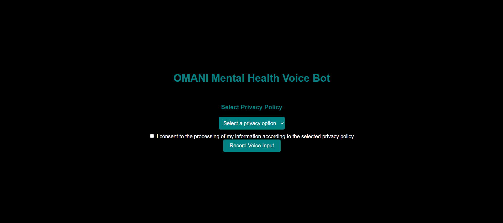

# 🕌 Omani-Mental Health AI Voice Bot
*Culturally-aware, AI voice-based mental health assistant for real-time counselling support in Omani Arabic*

---


---
A culturally-sensitive, real-time Arabic voice chatbot built with Flask, designed to provide therapeutic-grade support in the **Omani dialect**. It includes speech recognition, emotional intelligence, spiritual integration, and Arabic emotional TTS output for fully voice-based therapy.

---
## Application Data Flow
1. Voice Input (microphone) 
   ↓
2. Transcription (Groq Whisper) 
   ↓
3. Emotion & Intent Detection (emotion_intent.py with few-shot prompt templates)
   ↓
4. Response Generation 
   - dialect handling (omani_arabic dialect)
   - Prompt Templates (CBT + Spiritual + Cultural)
   - Dual LLM (OpenAI + Claude fallback)
   ↓
5. Safety Mechanism & Filtering
   - Suicide risk detection
   - Harmful intent filtering
   - Escalation + Referral protocols
   ↓
6. Response Evaluation (openai vs claude)
   ↓
7. Voice Output (TTS: Arabic-Omani dialect)
   ↓
8. Session Logging + Consent + Emergency Trigger + HIPAA Compliance
---

## Modular Pipeline
voice_input, transcriber, emotion_intent, intent_classifier, response_generator, etc.that makes the app maintainable and testable.

**1.Multithreaded Emotion & Intent Detection**
Running emotion and intent detection in parallel threads to save latency — clever optimization.

**2.Contextual Prompting + History**
Keeping recent user interaction context and feeding it into the LLM shows that you're enabling multi-turn conversations, which is critical for therapeutic bots.

 **3.Safety Check**
Having safety.detect_risk() and halting response generation for suicidal ideation is essential for mental health apps. This shows you’re considering ethical safeguards.

**4.TTS with Emotion Control**
Using voice_tone from emotion detection to generate emotionally adaptive Arabic voice output shows attention to user empathy and localization.

**5.Privacy Policy & Logging**
Including a user-visible privacy policy and logging interactions with memory.remember_interaction() — great for audit and research use cases.

**6.Exception-Handling**
Robust try-except blocks throughout the app ensure graceful error recovery and improved user experience.

**7.LLM Fallback Mechanism**
Automatically switches from GPT-4o to Claude Opus if the primary model fails or returns low confidence output, ensuring high response reliability.

**8.Docker Support**
Fully containerized with a production-ready Dockerfile for seamless deployment across environments.

---
 ## Techniques Used in the AI Chatbot:
**Prompt Engineering (Role/System Prompting)**
- Defines the assistant as a culturally-aware therapist using empathetic, Gulf Arabic, and therapeutic tone.
- Enables the chatbot to code-switch between Arabic and English as needed.

**LLM-Based Emotion & Intent Detection**
- Uses Groq's LLaMA3-70B to analyze user messages and return emotion (e.g., "قلق") and intent (e.g., "استشارة").

 **Dialect Adaptation via Dictionary Lookup**
-Translates Modern Standard Arabic (MSA) to Omani dialect using a small curated dataset — helps localize responses naturally.

**Fallback and Latency Optimization**
- Uses both GPT-4o and Claude Sonnet, switching automatically if one fails — improves reliability and speed.

**Natural Dialogue Memory**
- Maintains conversation history to generate context-aware, multi-turn responses like a real therapist

## Language & Cultural Competency

| Aspect                       | Implementation                                                                 |
| ---------------------------- | ------------------------------------------------------------------------------ |
| **Dialect Authenticity**     | Custom-trained prompts, emotional lexicon for Omani Arabic + TTS with dialect. |
| **Cultural Appropriateness** | Prompts reflect stigma-aware, Gulf-centric mental health context.              |
| **Therapeutic Language**     | CBT-style empathetic, validating responses in Arabic/Islamic tone.             |
| **Emotional Intelligence**   | Emotion-intent vocab maps feelings like "خوف", "ضيق", "توتر", etc.              |
| **Religious Sensitivity**    | Integrates Islamic guideline, spiritual framing for anxiety, grief, and trauma.|

---
## Clinical Measures

| Feature                    | Approach                                                                    |
| -------------------------- | --------------------------------------------------------------------------- |
| **Therapeutic Techniques** | Cognitive Behavioral Therapy (CBT), active listening, psychoeducation.      |
| **Safety Protocols**       | Risk detection module flags suicidal phrases and returns escalation alerts. |
| **Conversation Quality**   | Realistic, humanized flow using recent chat history and structured prompts. |
| **Professional Standards** | Ethical standards embedded in prompt design and response templates.         |
| **User Experience**        | Latency-aware design, session memory, calming voice playback with tone.     |

---

##  Innovation & Problem Solving

| Area                    | Innovation                                                                    |
| ----------------------- | ----------------------------------------------------------------------------- |
| **Dual-Model Strategy** | GPT-4o (fast, primary) + Claude Opus (fallback) to compare tone/cultural fit. |
| **Cultural Innovation** | Custom few-shot examples based on Omani therapy cases, local idioms.          |
| **Performance**         | Response caching, parallel threads, evaluation report to score model fit.     |

---

## Evaluation
- Model Latency: Tracked in real-time, shown on UI.
- Model Comparison: Claude Opus vs GPT-4o response logs + evaluation sheet.
- Emotion Vocab: Maps detected feelings to response tones (e.g., "قلق" → calm tone).
- Prompt Tuning: Uses instruct-style prompt design for both clinical and Islamic framing.
---

## Privacy & Consent
- Users are shown a privacy policy on entry.
- Consent to record, transcribe, and analyze voice data is required.
- Suicide triggers are handled with a clear crisis message, optionally integrated with escalation.
---

```bash
# Setup environment
pip install -r requirements.txt

# Run with Flask
python app.py

# OR: Run in production
gunicorn -w 2 -b 0.0.0.0:5000 app:app
```

---
📢 **For clinical use, ensure integration with qualified mental health professionals and live escalation systems**
---

## Further Advancement

| Category                  | Future Enhancements                                                                                     |
| --------------------------| ------------------------------------------------------------------------------------------------------- |
| **Real-Time Voice Chat**  | Enable continuous listening loop with live transcript and backchannel cues (e.g., "mm", "go on").       |
| **Emergency Escalation**  | Integrate live human counselor fallback via Twilio, WhatsApp, or national mental health hotline API.    |
| **Personalized Profiles** | Create optional, privacy-safe user profiles to personalize therapeutic prompts and track progress.      |
| **Adaptive Memory**       | Enhance memory module with vector storage (e.g., FAISS/Chroma) to recall long-term context.             |
| **Voice-Only Mode**       | Build a mobile-first UI/UX for visually impaired users or fully voice-based interaction (React Native). |
| **Abuse Detection**       | Add anti-abuse logic to detect trolling, inappropriate input, or LLM prompt injection attempts.         |
| **Model Fine-Tuning**     | Fine-tune open-source LLM on culturally annotated Gulf therapy sessions for improved nuance.            |
| **Spiritual Modules**     | Deeper Islamic coping modules with Quranic ayat, prophetic traditions, and duʿāʾ for trauma relief.     |
| **Analytics Dashboard**   | Admin panel to track anonymized usage, crisis detection rates, model drift, and latency insights.       |
| **Differential Privacy**  | Implement differential privacy and anonymization for voice logs and transcript storage.                 |
| **Multilingual Support**  | Add dialect detection (Hijazi, Najdi, Egyptian) + English/Arabic code-switching fluency handling.       |
| **EMR Integration**       | Optional connection to Electronic Medical Records (EMR) for institutional deployment.                   |
| **Feedback Loop**         | Allow users or clinicians to rate responses and improve prompt tuning automatically.                    |
| **Clinical Supervision**  | Build supervision tools for psychologists to review AI-guided sessions and give feedback.               |
| **LLM Adapter Plugin**    | Allow hot-swappable LLMs (Groq, Mistral, LLaMA 3) for cost-performance trade-offs.                      |

---
**Can easily be transferable in AI agent using LANGGRAPH or CREWAI**
---
**Contact details** qurat-zee@hotmail.com
---
